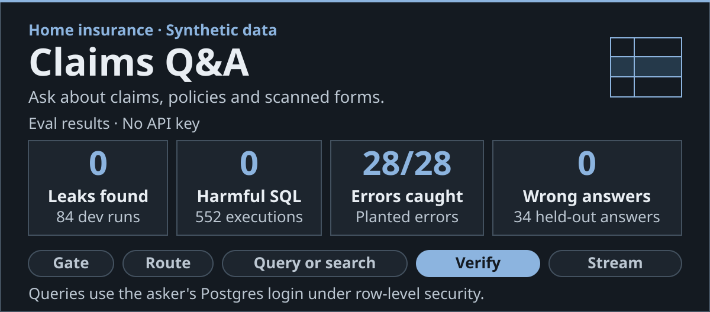
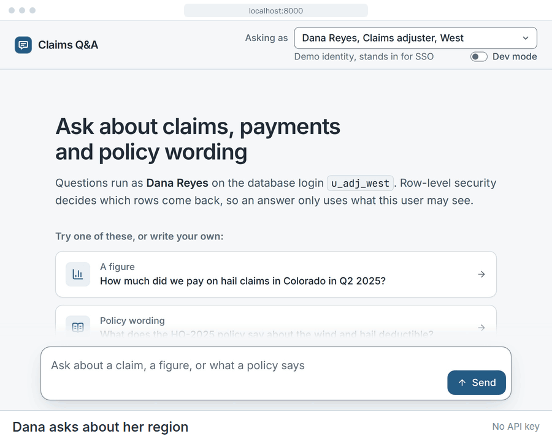
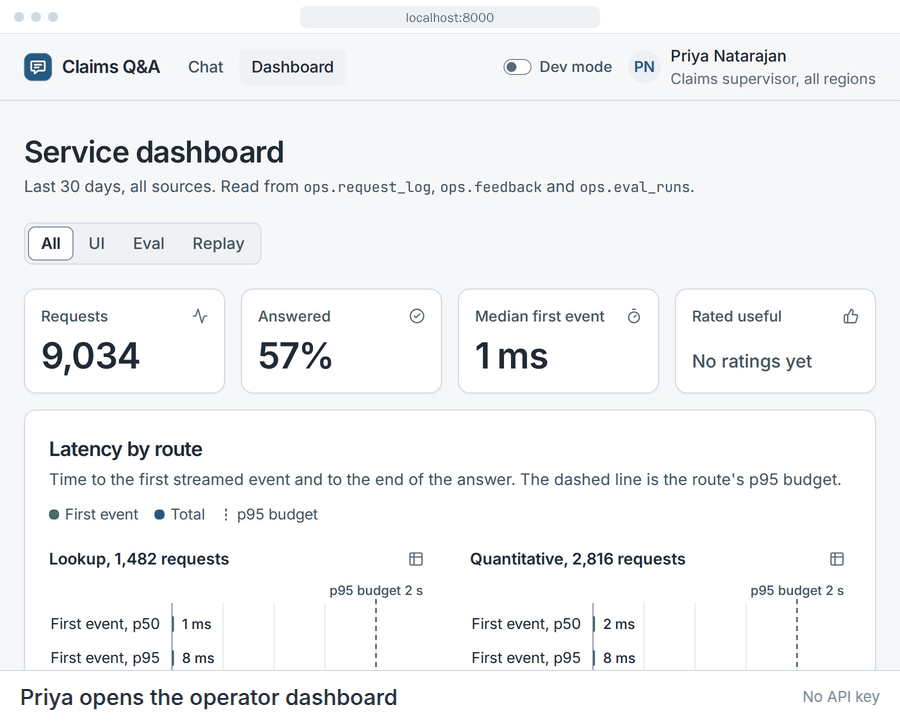
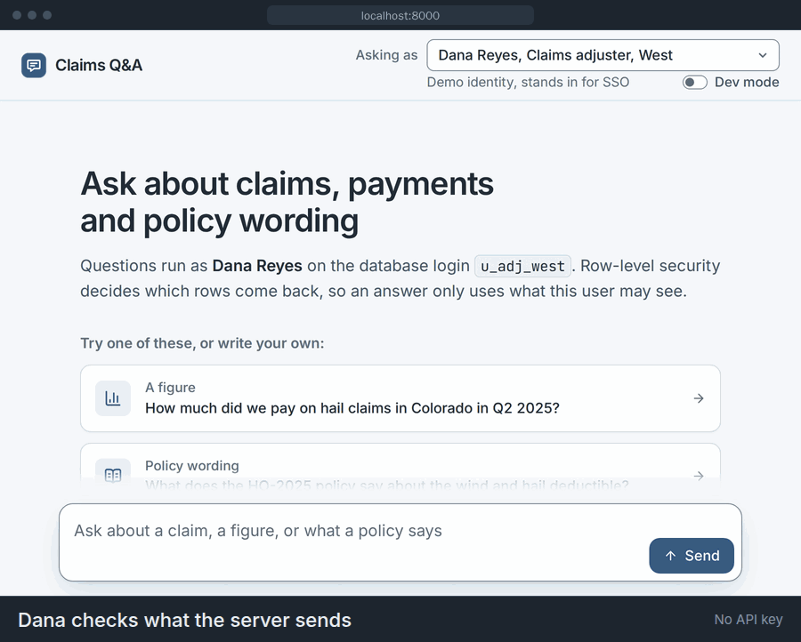
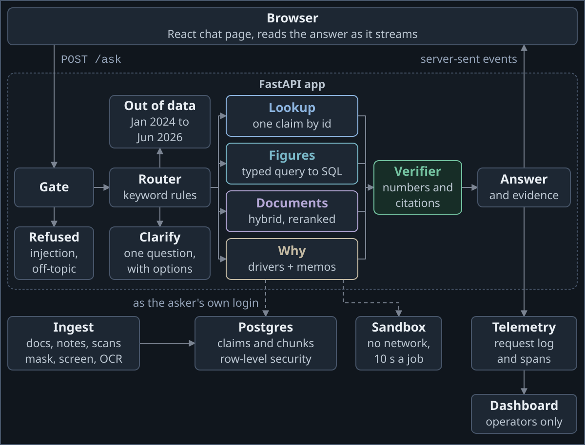
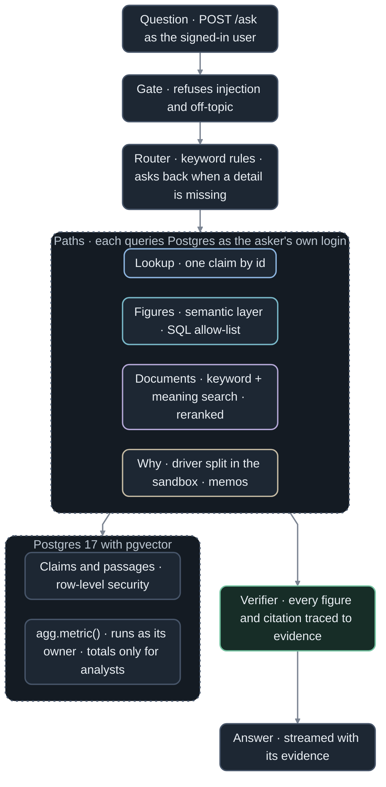
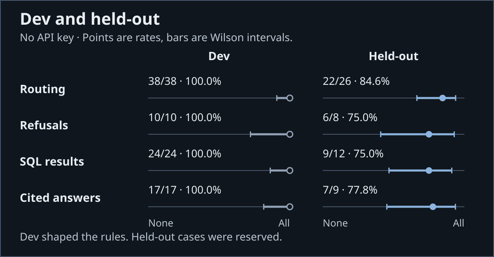

<a href="#numbers"></a>

[](https://github.com/jameswniu/insurance-claims-rag-search-retrieval/actions/workflows/checks.yml)
[](https://github.com/jameswniu/insurance-claims-rag-search-retrieval/actions/workflows/tests.yml)
[](LICENSE)

I built a question-and-answer app over a home insurer's claims, policies, and scanned forms, where every answer it gives shows the evidence behind it and each user's own database login decides which rows they can see. Those are the two things a company needs before it lets AI near sensitive data, so the database itself enforces who sees each row, and a checker traces every figure and citation back to its source before an answer goes out.

In evals that run with no API key, there were 0 leaks in 84 permission tests, 0 harmful results in 552 hostile attempts on the database, 28 of 28 planted wrong answers caught, and 0 wrong answers among the 34 given to held-out questions, the ones I never tuned the rules on.

The insurer and its data are made up, some held-out groups are small, and it has not faced real production data or a real attacker.

## Demo

Dana, a claims adjuster for the West region, asks what was paid on Colorado hail claims in Q2 2025. The answer comes back with the exact SQL that ran under her own database login.

[](https://cdn.jsdelivr.net/gh/jameswniu/insurance-claims-rag-search-retrieval@6cbff6ef61ad788ce35553bb6658dfcc90adce82/docs/demo/ask.mp4)

Two adjusters and an analyst ask about the same West claim. Only Dana gets it back. Omar covers East, so he gets the reply a missing claim returns and cannot tell the claim exists.

[](https://cdn.jsdelivr.net/gh/jameswniu/insurance-claims-rag-search-retrieval@6cbff6ef61ad788ce35553bb6658dfcc90adce82/docs/demo/permissions.mp4)

| Who asks | What they get |
|---|---|
| Dana Reyes, claims adjuster, West, as `u_adj_west` | The claim itself: open, a fire loss in Colorado, $33,474 paid |
| Omar Haddad, claims adjuster, East, as `u_adj_east` | The reply a missing claim gets, "I can't find claim 105964." |
| Sam Whitfield, analyst, as `u_analyst` | No claim at all, "Analysts see aggregates only, so I can't open individual claims." |

Priya is a claims supervisor and an operator. She sees all four regions and gets the dashboard at `/dashboard`. The dashboard charts the request log beside the latest eval scores and filters by where each request came from.

[](https://cdn.jsdelivr.net/gh/jameswniu/insurance-claims-rag-search-retrieval@6cbff6ef61ad788ce35553bb6658dfcc90adce82/docs/demo/dashboard.mp4)

The Dev mode switch in the header turns the page dark and docks a console that logs each event the server streams for a question.

[](https://cdn.jsdelivr.net/gh/jameswniu/insurance-claims-rag-search-retrieval@6cbff6ef61ad788ce35553bb6658dfcc90adce82/docs/demo/devmode.mp4)

Click any GIF on this page, or a clip below, to play the full video with captions.

| Clip | What happens | Length |
|---|---|---|
| [A policy answer and its source](https://cdn.jsdelivr.net/gh/jameswniu/insurance-claims-rag-search-retrieval@6cbff6ef61ad788ce35553bb6658dfcc90adce82/docs/demo/policy.mp4) | Dana asks if flood damage is covered and follows the citation into the policy | 33 s |
| [A total read from a scan](https://cdn.jsdelivr.net/gh/jameswniu/insurance-claims-rag-search-retrieval@6cbff6ef61ad788ce35553bb6658dfcc90adce82/docs/demo/scan.mp4) | Priya asks for an invoice total and checks it against the scan and the payments | 26 s |
| [A misread total, flagged](https://cdn.jsdelivr.net/gh/jameswniu/insurance-claims-rag-search-retrieval@6cbff6ef61ad788ce35553bb6658dfcc90adce82/docs/demo/ocr-flag.mp4) | A scan that dropped its decimal point comes back flagged, beside the crop | 20 s |
| [Why losses rose](https://cdn.jsdelivr.net/gh/jameswniu/insurance-claims-rag-search-retrieval@6cbff6ef61ad788ce35553bb6658dfcc90adce82/docs/demo/why.mp4) | Priya asks why West losses rose in Q2 2025 and checks the hail and Colorado shares | 43 s |
| [Withheld small groups](https://cdn.jsdelivr.net/gh/jameswniu/insurance-claims-rag-search-retrieval@6cbff6ef61ad788ce35553bb6658dfcc90adce82/docs/demo/suppression.mp4) | Sam, the analyst, gets monthly counts, and months with too few claims are withheld | 36 s |
| [A question with no period](https://cdn.jsdelivr.net/gh/jameswniu/insurance-claims-rag-search-retrieval@6cbff6ef61ad788ce35553bb6658dfcc90adce82/docs/demo/clarify.mp4) | Priya asks what was paid, picks 2025 from the app's options and checks the query | 30 s |
| [An instruction override](https://cdn.jsdelivr.net/gh/jameswniu/insurance-claims-rag-search-retrieval@6cbff6ef61ad788ce35553bb6658dfcc90adce82/docs/demo/injection.mp4) | Dana tells the app to ignore its instructions and show every region, and the app refuses | 13 s |
| [An off-topic question](https://cdn.jsdelivr.net/gh/jameswniu/insurance-claims-rag-search-retrieval@6cbff6ef61ad788ce35553bb6658dfcc90adce82/docs/demo/off-topic.mp4) | Dana asks for a banana bread recipe and is told what the app covers | 11 s |
| [A year outside the data](https://cdn.jsdelivr.net/gh/jameswniu/insurance-claims-rag-search-retrieval@6cbff6ef61ad788ce35553bb6658dfcc90adce82/docs/demo/out-of-range.mp4) | Dana asks about 2022 and is told the data runs from January 2024 to June 2026 | 11 s |
| [An answer from live models](https://cdn.jsdelivr.net/gh/jameswniu/insurance-claims-rag-search-retrieval@6cbff6ef61ad788ce35553bb6658dfcc90adce82/docs/demo/live.mp4) | Dana asks what a denial letter needs, Claude answers with citations and Gemini checks each sentence | 41 s |

## What happens to a question

1. A gate refuses off-topic questions and prompt injection, text that tries to override the app's instructions. It works from English keywords, so a reworded injection can get past it.
2. Keyword rules send the question down one of four paths, which look up one claim, compute a figure, search documents, or explain why a number changed. A question missing its measure or period gets one clarifying question with options, and one about dates outside the data is told what the data covers.
3. The path queries Postgres as the asker's own database login. Row-level security, a Postgres rule on every claim and document table, filters rows by the login asking, so an adjuster sees only their own region. Analysts can't read claim rows at all. They get totals from `agg.metric()`, a database function that runs with its owner's rights and withholds any group with fewer than 10 claims or one claim over half the total.
   - Figure questions are compiled into SQL by a semantic layer, a fixed list of measures such as paid losses, and a parser checks the SQL against an allow-list before it runs.
   - Document questions combine keyword search with meaning-based search in pgvector, a Postgres extension, and a small model reranks the passages.
   - Why questions split a change by cause of loss and by state in the sandbox, a throwaway container with no network, then look for the memo from around that time.
4. A verifier traces every figure to the query or analysis result it came from, and every citation to a passage retrieved for this user, then cuts any statement that fails those checks.
5. The answer streams back with its evidence, the SQL, rows and passages behind it.

All of this runs with no API key. The only models are two small ones inside the image, for the meaning search and the reranking. Setting `LLM_BACKEND` turns on live mode, which adds Claude where the rules run out and can add Gemini to check each written sentence. Even then, no model writes SQL, since a model can only fill in the same structured query that the compiler turns into SQL.



<details><summary>The same flow as a flowchart</summary>



</details>

[docs/DESIGN.md](docs/DESIGN.md) follows one request through the code and gives each decision with what it cost.

## What could go wrong, and what stops it

In the Measured column, dev cases are the ones I tuned the rules on, and held-out cases are the ones I kept aside.

| Risk | What stops it | Measured |
|---|---|---|
| An adjuster asks about another region's claims | Row-level security on their own login | Found 0 leaks in 84 runs |
| A generated query changes data or reads personal details | Read-only logins that can't read SSNs, birth dates, emails or phone numbers | 0 harmful in 552 hostile runs |
| Analysis code runs wild | A throwaway container with no network | All [13 hostile programs](tests/sandbox/test_limits.py) contained |
| A stored note hides an instruction | Notes are screened as they load, and a flagged one never comes back from search | Quarantined [20 of 20 planted notes](tests/docs/test_injection_screen.py) |
| A prompt injection or an off-topic question | The gate refuses it before routing | Refused 10 of 10 dev, 6 of 8 held-out |
| An answer states a wrong figure | The verifier cuts any statement with a figure it can't trace | Caught 28 of 28 planted errors, cut 0 of 28 clean answers |
| A question asks about dates outside the data | The app says what the data covers | Right in 3 of 3 dev, 2 of 2 held-out |
| Search misses the passage that answers it | Keyword and meaning search combined, then reranked | Relevant passages in the top 5, 16 of 17 dev, 11 of 11 held-out |
| Reading a scan drops a decimal point | A total must look like currency and match the claim's payments | Flagged 16 of 20 misread or mismatched fields |

[DESIGN.md](docs/DESIGN.md#failure-modes) has the full list, each with its test.

## Numbers

`make eval` scores every case with no API key. I tuned the rules on the dev cases only. The held-out cases were written at the same time and locked with a checksum when the first rules went in. One label has changed since, and [EVALS.md](docs/EVALS.md#the-cases) says why. The ranges in parentheses and the bars in the chart are 95% Wilson intervals, showing where the true rate likely falls given so few cases.



<details><summary>Exact counts and intervals</summary>

Gold SQL is the hand-written correct query for each figure question.

| Check | Dev | Held-out |
|---|---|---|
| Routed to the right path | 38 of 38 (0.91 to 1.00) | 22 of 26 (0.66 to 0.94) |
| Refused when they should be | 10 of 10 (0.72 to 1.00) | 6 of 8 (0.41 to 0.93) |
| Refused only when they should be | 10 of 10 (0.72 to 1.00) | 6 of 6 (0.61 to 1.00) |
| Answerable questions refused | 0 of 23 (0.00 to 0.14) | 0 of 14 (0.00 to 0.22) |
| Figure answers equal to gold SQL | 24 of 24 (0.86 to 1.00) | 9 of 12 (0.47 to 0.91) |
| Document answers citing a relevant passage | 17 of 17 (0.82 to 1.00) | 7 of 9 (0.45 to 0.94) |
| Why answers naming the planted driver | 4 of 4 (0.51 to 1.00) | 3 of 3 (0.44 to 1.00) |
| Scan answers passed | 13 of 13 (0.77 to 1.00) | 3 of 3 (0.44 to 1.00) |
| Wrong answers among all answers | 0 of 79 (0.00 to 0.05) | 0 of 34 (0.00 to 0.10) |

On dev, answers to why questions take 928 ms at the median and everything else takes under a second. To check the rules were not just matching my own phrasing, Codex, a GPT model, rewrote 56 dev routing and figure questions with rewordings and typos. The rewrites went down the right path 147 of 168 times, and the figure ones matched gold SQL 54 of 72 times. [EVALS.md](docs/EVALS.md) has every table, and [REFEREE.md](docs/REFEREE.md) shows how each headline number is counted.

With live models on, scored on 2026-09-25 over 3 runs for $4.50 with claude-sonnet-5, claude-haiku-4-5, and gemini-3.5-flash, the app got 1 of 37 held-out answers wrong and leaked 0 rows in the permission tests, which run on the dev cases. [Its full table](docs/EVALS.md#live-mode) has the rest.

</details>

## Run it

You need Docker 24 or later and about 1.5 GB of memory. No API key is needed.

```sh
git clone https://github.com/jameswniu/insurance-claims-rag-search-retrieval
cd insurance-claims-rag-search-retrieval
make up
```

The first run seeds 6,951 claims and reads 60 scanned forms, which took 2 minutes on a GitHub arm runner. `make up` ends by printing the address to open, http://localhost:8000 unless another program holds that port. Pick a user and ask.

Every other command runs from the same folder, in any terminal.

```sh
cd insurance-claims-rag-search-retrieval
make logs              # follow the server logs, Ctrl+C stops following
make test              # the test suite, in a container
make test-sandbox      # the sandbox limit tests, on the host where Docker runs
make eval              # score every eval case into evals/report.json
APP_PORT=8100 make up  # start on a port you choose
make down              # stop, keeping the database
make reset             # delete the database, so the next make up starts fresh
```

To see each event the server streams for a question, switch on Dev mode in the app's header. A console docks under the question box and logs every event, with its JSON a click away.

To add live models, copy `.env.example` to `.env`, set `LLM_BACKEND` and its API key there, then run `make live-check` to confirm each model answers and `make up-live` to start.

## What changes in production

| This repo | In production |
|---|---|
| One database login per job and region, under row-level security | The user's sign-in token traded for a short-lived login to that role, so no password sits in the app |
| The demo's user picker | Single sign-on through a proxy in front of the app that vouches for each user |
| Analysis code in a throwaway Docker container, started by a helper service that holds the Docker socket, which is root on the host | Firecracker microVMs or gVisor, both built to run untrusted code |
| Exact meaning search over a few hundred passages | An approximate index (HNSW) with iterative scan on, so filtering by permission still returns enough passages |
| Small groups withheld from analysts | Query auditing as well, which refuses a total that could be subtracted from another to reveal a withheld group |
| Request and audit logs in Postgres, with traces of each step sent over OTLP, OpenTelemetry's protocol, when an endpoint is set | An OpenTelemetry collector at that endpoint, and a tracing backend |

Apache 2.0, see [LICENSE](LICENSE).
