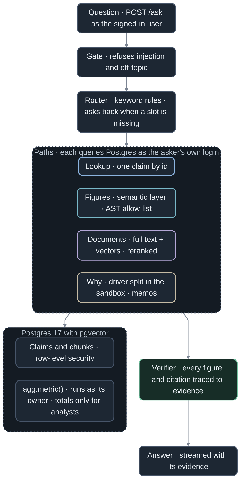

<a href="#numbers"></a>

[](https://github.com/jameswniu/insurance-claims-rag-search-retrieval/actions/workflows/checks.yml)
[](https://github.com/jameswniu/insurance-claims-rag-search-retrieval/actions/workflows/tests.yml)
[](LICENSE)

## Run it

You need Docker 24 or later and about 1.5 GB of memory. No API key is needed.

```sh
git clone https://github.com/jameswniu/insurance-claims-rag-search-retrieval
cd insurance-claims-rag-search-retrieval
make up
```

The first run seeds 6,951 claims and reads 60 scanned forms, which took 2 minutes on a GitHub arm runner. `make up` ends by printing the address to open, http://localhost:8000 unless another program holds that port. Pick a user and ask.

Every other command runs from the same folder, in any terminal.

```sh
cd insurance-claims-rag-search-retrieval
make logs              # follow the server logs, Ctrl+C stops following
make test              # the test suite, in a container
make test-sandbox      # the sandbox limit tests, on the host where Docker runs
make eval              # score every eval case into evals/report.json
APP_PORT=8100 make up  # start on a port you choose
make down              # stop, keeping the database
make reset             # delete the database, so the next make up starts fresh
```

To see each event the server streams for a question, switch on Dev mode in the app's header. A console docks under the question box and logs every event, with its JSON a click away.

To add live models, copy `.env.example` to `.env`, set `LLM_BACKEND` and its API key there, then run `make live-check` to confirm each model answers and `make up-live` to start.

## Demo

Dana, a West adjuster, asks what was paid on Colorado hail claims in Q2 2025. The answer comes back with the exact SQL that ran under her own database login.

[](https://cdn.jsdelivr.net/gh/jameswniu/insurance-claims-rag-search-retrieval@6cbff6ef61ad788ce35553bb6658dfcc90adce82/docs/demo/ask.mp4)

Click any GIF on this page, or a clip below, to play the full video with captions.

| Clip | What happens | Length |
|---|---|---|
| [A policy answer and its source](https://cdn.jsdelivr.net/gh/jameswniu/insurance-claims-rag-search-retrieval@6cbff6ef61ad788ce35553bb6658dfcc90adce82/docs/demo/policy.mp4) | Dana asks if flood damage is covered and follows the citation into the policy | 33 s |
| [A total read from a scan](https://cdn.jsdelivr.net/gh/jameswniu/insurance-claims-rag-search-retrieval@6cbff6ef61ad788ce35553bb6658dfcc90adce82/docs/demo/scan.mp4) | Priya asks for an invoice total and checks it against the scan and the payments | 26 s |
| [A misread total, flagged](https://cdn.jsdelivr.net/gh/jameswniu/insurance-claims-rag-search-retrieval@6cbff6ef61ad788ce35553bb6658dfcc90adce82/docs/demo/ocr-flag.mp4) | A scan that dropped its decimal point comes back flagged, beside the crop | 20 s |
| [Why losses rose](https://cdn.jsdelivr.net/gh/jameswniu/insurance-claims-rag-search-retrieval@6cbff6ef61ad788ce35553bb6658dfcc90adce82/docs/demo/why.mp4) | Priya asks why West losses rose in Q2 2025 and checks the hail and Colorado shares | 43 s |
| [Withheld small groups](https://cdn.jsdelivr.net/gh/jameswniu/insurance-claims-rag-search-retrieval@6cbff6ef61ad788ce35553bb6658dfcc90adce82/docs/demo/suppression.mp4) | Sam, the analyst, gets monthly counts, and months with too few claims are withheld | 36 s |
| [A question with no period](https://cdn.jsdelivr.net/gh/jameswniu/insurance-claims-rag-search-retrieval@6cbff6ef61ad788ce35553bb6658dfcc90adce82/docs/demo/clarify.mp4) | Priya asks what was paid, picks 2025 from the app's options and checks the query | 30 s |
| [An instruction override](https://cdn.jsdelivr.net/gh/jameswniu/insurance-claims-rag-search-retrieval@6cbff6ef61ad788ce35553bb6658dfcc90adce82/docs/demo/injection.mp4) | Dana tells the app to ignore its instructions and show every region, and the gate refuses | 13 s |
| [An off-topic question](https://cdn.jsdelivr.net/gh/jameswniu/insurance-claims-rag-search-retrieval@6cbff6ef61ad788ce35553bb6658dfcc90adce82/docs/demo/off-topic.mp4) | Dana asks for a banana bread recipe and is told what the app covers | 11 s |
| [A year outside the data](https://cdn.jsdelivr.net/gh/jameswniu/insurance-claims-rag-search-retrieval@6cbff6ef61ad788ce35553bb6658dfcc90adce82/docs/demo/out-of-range.mp4) | Dana asks about 2022 and is told the data runs from January 2024 to June 2026 | 11 s |
| [An answer from live models](https://cdn.jsdelivr.net/gh/jameswniu/insurance-claims-rag-search-retrieval@6cbff6ef61ad788ce35553bb6658dfcc90adce82/docs/demo/live.mp4) | Dana asks what a denial letter needs, Claude answers with citations and Gemini checks each sentence | 41 s |

## How it works




- Analysts get totals only, from `agg.metric()`, which runs as its owner and withholds any group with fewer than 10 claims or one claim over half the total.
- No step needs a language model. `LLM_BACKEND` turns on live mode, which adds Claude, and optionally Gemini as the checker.

## What could go wrong, and what stops it

| Risk | What stops it | Measured |
|---|---|---|
| An adjuster asks about another region | Their own login, under row-level security | Found {{n dev.permissions.leaks}} leaks in {{n dev.permissions.runs}} runs |
| Generated SQL writes or reads PII | Read-only logins with no PII grants | {{n shared.hostile_sql.harmful}} harmful executions in {{n shared.hostile_sql.executions}} executions |
| Analysis code runs wild | A throwaway container with no network | All [13 hostile programs](tests/sandbox/test_limits.py) contained |
| A stored note hides an instruction | Ingest quarantines it before search | Quarantined [20 of 20 planted notes](tests/docs/test_injection_screen.py) |
| An injection or off-topic question | The gate refuses it before routing | Refused {{n dev.refusal.recall}} dev, {{n heldout.refusal.recall}} held-out |
| An answer states a wrong figure | The verifier cuts untraced sentences | Caught {{n shared.verifier.recall}} planted errors, cut {{n shared.verifier.false_alarms}} clean answers |
| A question is outside the data | The app says so | Right in {{n dev.abstention.out_of_data}} dev, {{n heldout.abstention.out_of_data}} held-out |
| Search misses the right passage | Full-text and vector search, reranked | Recall@5 {{n dev.retrieval.hybrid.recall_at_5}} dev, {{n heldout.retrieval.hybrid.recall_at_5}} held-out |
| OCR drops a decimal point | Totals must look like currency and match the claim's payments | Flagged {{n shared.ocr_extraction.flag_recall}} misread fields |

The full list, with tests, is in [DESIGN.md](docs/DESIGN.md#failure-modes).

## Numbers

`make eval` scores these with no API key. Dev cases shaped the rules, held-out cases didn't, and brackets are 95% Wilson intervals.


<details><summary>Exact counts and intervals</summary>

{{table headline}}

On dev, why answers take {{n dev.latency.why.p50_ms}} ms at the median and everything else under a second. Codex, a GPT model, rewrote {{n dev.robustness.routing.original.n}} dev routing and figure questions with rewordings and typos. The rewrites route right {{n dev.robustness.routing.variants}}, and the figure ones match gold SQL {{n dev.robustness.sql.variants}}. [EVALS.md](docs/EVALS.md) has every table.

Live mode, scored {{n live.date}} over {{n live.runs}} runs for {{n live.cost_usd}} with {{n live.models.main}}, {{n live.models.fast}} and {{n live.models.check}}, got {{n live.metrics.heldout.abstention.wrong_answer}} held-out answers wrong, and leaked {{n live.metrics.dev.permissions.leaks}} rows on the dev split, where the permission probes ran, as [its full table](docs/EVALS.md#live-mode) shows.

</details>

## Who sees what

Two adjusters and the analyst ask about the same West claim.

[](https://cdn.jsdelivr.net/gh/jameswniu/insurance-claims-rag-search-retrieval@6cbff6ef61ad788ce35553bb6658dfcc90adce82/docs/demo/permissions.mp4)

| Who asks | What they get |
|---|---|
| Dana Reyes, claims adjuster, West, as `u_adj_west` | The claim itself: open, a fire loss in Colorado, $33,474 paid |
| Omar Haddad, claims adjuster, East, as `u_adj_east` | The reply a missing claim gets, "I can't find claim 105964." |
| Sam Whitfield, analyst, as `u_analyst` | No claim at all, "Analysts see aggregates only, so I can't open individual claims." |

## Dashboard

`/dashboard`, for operators only, charts the request log beside the latest eval scores and filters it by where each request came from.

[](https://cdn.jsdelivr.net/gh/jameswniu/insurance-claims-rag-search-retrieval@6cbff6ef61ad788ce35553bb6658dfcc90adce82/docs/demo/dashboard.mp4)

## Dev mode

The Dev mode switch in the header turns the page dark and docks a console that logs each event the server streams for a question.

[](https://cdn.jsdelivr.net/gh/jameswniu/insurance-claims-rag-search-retrieval@6cbff6ef61ad788ce35553bb6658dfcc90adce82/docs/demo/devmode.mp4)

## From laptop to production

| This repo | In production |
|---|---|
| A Postgres login per job and region, under row-level security | The user's sign-in token traded for a short-lived login to that role, so no password sits in the app |
| The demo's user picker | Single sign-on through an identity-aware proxy |
| Analysis code in a throwaway Docker container that the `sandboxd` service starts | Firecracker microVMs or gVisor |
| Exact vector search over a few hundred chunks | An HNSW index with iterative scan |
| Small groups withheld from analysts | Query auditing as well, which refuses a total that could be subtracted from another to reveal a withheld group |
| Request and audit logs in Postgres, with spans exported over OTLP when an endpoint is set | An OpenTelemetry collector at that endpoint, and a tracing backend |

## More

[docs/DESIGN.md](docs/DESIGN.md) has every decision and failure mode, and the detail this page leaves out. [docs/REFEREE.md](docs/REFEREE.md) shows how each headline number is counted.

Apache 2.0, see [LICENSE](LICENSE).
